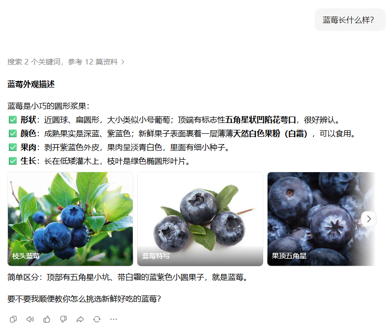
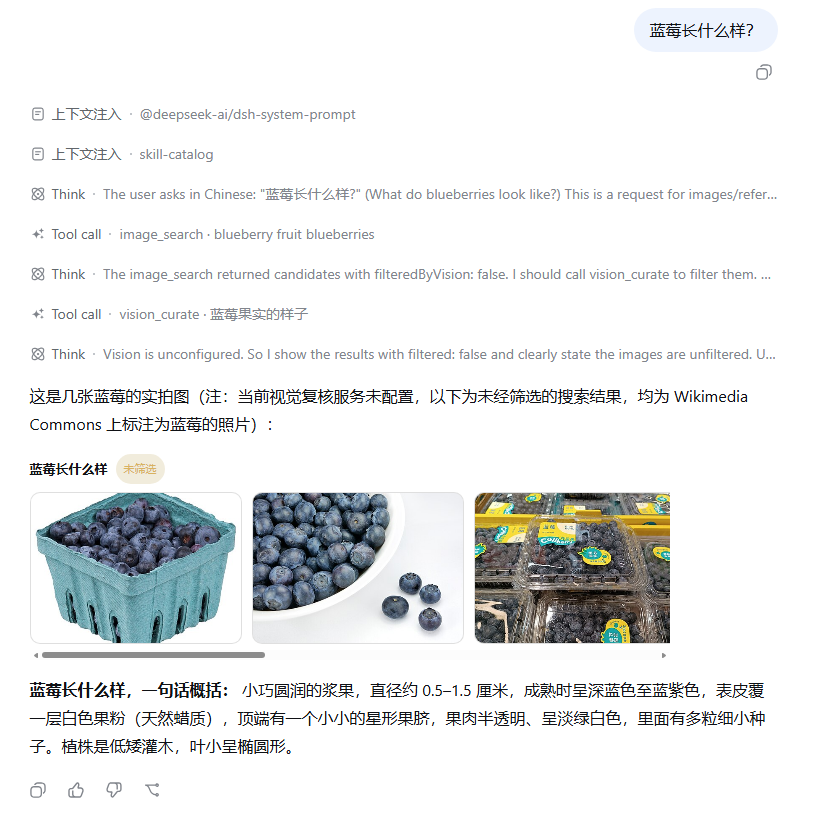
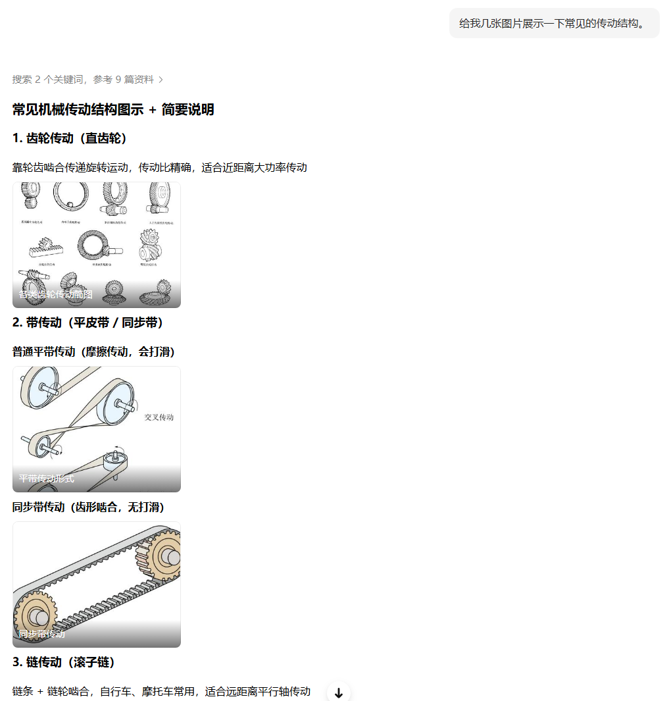
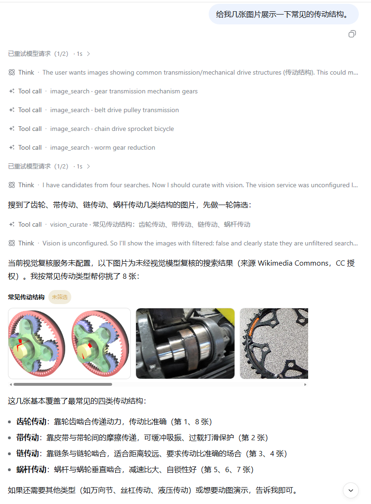

# dsh-gallery

> 🌏 简体中文说明见 [README.zh.md](README.zh.md)

A **visual output channel plugin** for [DeepSeek Harness](https://github.com/deepseek-ai/deepseek-harness) (DSH): lets the agent insert a **horizontally scrollable multi-image card** into its reply. Images come from CC-licensed gallery search and are curated by a configurable vision model (default: Zhipu GLM-4.6V-Flash) for relevance and safety.

In one line: **give the DSH whale eyes, then show you what it saw.**

## Side-by-side

| Doubao (official chat UI) | dsh-gallery (this plugin) |
| --- | --- |
|  |  |

### Concept illustration: mechanical transmission structures

| Doubao (official chat UI) | dsh-gallery (this plugin) |
| --- | --- |
|  |  |

_The plugin assembles searched images into a titled card — here covering common mechanical transmission structures._

## Capabilities

- In-conversation image cards: horizontal scroll, tap to enlarge, caption + source attribution, an `unfiltered` badge when no vision model is configured
- Two agent tools: `image_search` (Wikimedia Commons / Openverse, CC-licensed, key-less) and `vision_curate` (relevance / safety / one-line caption)
- **Install-and-use with zero config**: domestic Bing image search (`adlt=strict` safe search, key-less) as fallback when overseas sources are unreachable, local-proxy auto-discovery, and per-source retries
- A "Vision Model" settings page: API key (local credential store, write-only) + endpoint / model / candidate count / source toggles — changes apply live
- Proxy-aware networking: honors `DSH_GALLERY_HTTPS_PROXY` (then HTTPS_PROXY / HTTP_PROXY) via undici's standard CONNECT tunnel

## Install (local development, link)

```powershell
cd <repo-dir>
pnpm install
pnpm run build          # typecheck + bundles (lib/index.js, lib/client.js)
dsh plugin --profile web add link:<absolute-repo-dir>
# restart DSH Web once to load the new bundle
```

Client-side iteration loop after the first load: `pnpm run build` → the page hot-swaps within ~1s (DSH's built-in client HMR). Host-side changes require a restart.

## Configuration

| Surface | Items | Notes |
| --- | --- | --- |
| Settings → Vision Model | API key / endpoint / model / candidate count / source toggles | Recommended; key stays in the local credential store |
| Environment variables (before `dsh web`) | `DSH_GALLERY_VISION_KEY` / `DSH_GALLERY_VISION_BASE_URL` / `DSH_GALLERY_VISION_MODEL` / `DSH_GALLERY_HTTPS_PROXY` / `DSH_GALLERY_WIKIMEDIA_URL` / `DSH_GALLERY_OPENVERSE_URL` | env wins over the settings page |
| Defaults | endpoint `https://open.bigmodel.cn/api/paas/v4`, model `glm-4.6v-flash` (free) | both sources on |

## Verification

```powershell
pnpm test               # unit + integration (fake local triple endpoints, real fetch), 33 tests
pnpm run test:browser   # isolated Chromium acceptance, 14 checks (mount / invalid-degrade / mutation / https whitelist / lightbox / 375px scroll)
pnpm run build
node scripts\probe-glm.mjs glm-4.6v-flash   # vision API contract probe (never prints the key)
```

## Real acceptance (after restarting DSH)

1. New conversation: "find me 5 cyberpunk night reference images" → the agent calls `image_search`, replies with a scrollable image card; tapping opens the lightbox with source links. Without a key the card shows the `unfiltered` badge.
2. "What does a differential look like inside, with pictures" → same pipeline (concept illustration).
3. Settings → Vision Model: after saving a key, re-run — the badge disappears (curation active).

## Naming

`dsh-gallery`: a gallery is exactly a horizontally scrollable set of images; follows the `dsh-*` ecosystem convention. Alternative considered: `dsh-lookbook`.

## License

[AGPL-3.0](LICENSE) — free for any use, including commercial use, as long as derivative works (especially closed-source network deployments) are released under the same license. **For closed-source commercial use, a separate commercial license is available on request.**

Copyright (c) 2026 TomaxWade.

## Repository status

No API keys, credentials, user images, or runtime data are committed (`.env.local`, `output/`, `tmp/` are ignored). Internal design docs (`docs/`) and agent rules (`AGENTS.md`) are kept local only.
